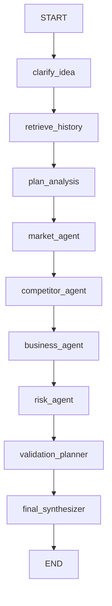

# Idea Validator

Idea Validator is a web app that helps users evaluate whether a startup idea is worth pursuing.
Instead of generating a generic brainstorming report, the product is designed to support a practical decision:

- Should this idea move forward?
- What are the biggest risks?
- What is the cheapest way to validate it?

## Product Goal

The MVP focuses on structured idea evaluation for:

- aspiring founders
- indie hackers
- product managers

The expected output is not just "analysis", but a clear recommendation with concrete next steps.

## Recommended Tech Stack

- Frontend: a minimal static HTML/CSS/JS client in `frontend/`
- Backend: FastAPI
- Agent orchestration: LangGraph
- Data validation: Pydantic
- LLM integration: LangChain + ChatOpenAI
- Web search: provider-backed search service for market and competitor evidence
- Database: PostgreSQL, or SQLite for local MVP development
- Async jobs: not required for v1; run analysis synchronously first

## Why This Stack

The main complexity of this product is the analysis workflow, not the UI.

FastAPI and Pydantic provide a clean way to define request and response contracts.
LangGraph is a strong fit because the problem is naturally multi-step:

1. clarify the idea
2. analyze demand
3. review competitors
4. evaluate the business model
5. identify risks
6. propose a validation plan
7. produce a final verdict

This makes the backend the core of the product.

The current architecture is `LLM-first, schema-constrained, code-orchestrated`:

- LLMs handle reasoning, synthesis, and structured generation
- web search brings current external evidence into selected nodes
- retrieval brings similar historical analyses back into the decision loop
- Pydantic schemas constrain node outputs
- LangGraph manages execution order and shared state
- Python fallback logic keeps the graph from failing hard when the model is unavailable

## Project Structure

```text
idea_validator/
├── .env
├── .env.example
├── .gitignore
├── app/
│   ├── main.py
│   ├── api/
│   │   └── routes.py
│   ├── schemas/
│   │   ├── input.py
│   │   ├── output.py
│   │   └── state.py
│   ├── graph/
│   │   ├── builder.py
│   │   └── nodes/
│   │       ├── clarify_idea.py
│   │       ├── plan_analysis.py
│   │       ├── market_agent.py
│   │       ├── competitor_agent.py
│   │       ├── business_agent.py
│   │       ├── risk_agent.py
│   │       ├── validation_planner.py
│   │       └── final_synthesizer.py
│   ├── services/
│   │   ├── llm.py
│   │   ├── prompt_loader.py
│   │   ├── retrieval.py
│   │   ├── web_search.py
│   │   └── scoring.py
│   ├── prompts/
│   │   ├── clarify.txt
│   │   ├── market.txt
│   │   ├── competitor.txt
│   │   ├── business.txt
│   │   ├── risk.txt
│   │   ├── validation.txt
│   │   └── final.txt
│   └── db/
│       ├── models.py
│       └── session.py
├── frontend/
│   ├── index.html
│   ├── loading.html
│   ├── result.html
│   ├── history.html
│   ├── detail.html
│   ├── styles.css
│   └── js/
│       ├── api.js
│       ├── index.js
│       ├── loading.js
│       ├── result.js
│       ├── history.js
│       ├── detail.js
│       └── render.js
├── tests/
├── requirements.txt
└── README.md
```

## Folder Responsibilities

- `app/main.py`: FastAPI application entrypoint
- `app/api/routes.py`: HTTP endpoints such as `/health`, `/analyze`, and history endpoints
- `app/schemas/`: Pydantic models and graph state definitions
- `app/graph/builder.py`: LangGraph assembly and execution flow
- `app/graph/nodes/`: individual graph steps, mostly LLM-driven with structured outputs
- `app/services/`: shared helpers such as LLM access, prompt loading, and scoring logic
- `app/prompts/`: prompt templates used by analysis nodes
- `app/db/`: database models and session management
- `frontend/`: static product UI for idea input, loading, results, history, and detail views
- `tests/`: unit and integration tests
- `.env`: local secrets and model configuration
- `.env.example`: example environment variable template

## Core Data Models

The backend should lock down three core models early:

- `IdeaInput`: the request payload submitted by the user
- `GraphState`: the internal state passed between LangGraph nodes
- `FinalReport`: the final structured response returned to the client

Defining these models early helps:

- validate data consistently
- keep node outputs stable
- prevent prompt drift from breaking the API
- make frontend rendering predictable

## LangGraph Workflow

The current graph runs as a serial workflow:

```text
clarify_idea
-> retrieve_history
-> plan_analysis
-> market_agent
-> competitor_agent
-> business_agent
-> risk_agent
-> validation_planner
-> final_synthesizer
```

### Graph Diagram



### Node Pattern

Most analysis nodes follow the same pattern:

1. read data from `GraphState`
2. render a prompt from `app/prompts/*.txt`
3. optionally enrich the node with web search context
4. optionally enrich the workflow with retrieved historical analyses
5. call `ChatOpenAI`
6. force structured output through a local Pydantic schema
7. write the validated result back into the graph state
8. fall back to deterministic Python logic if the LLM call fails

This keeps the product flexible without turning the graph into unstructured prompt chaining.

### Prompt Management

Prompts are stored as separate text files under `app/prompts/`.
Nodes load them through `app/services/prompt_loader.py`.

This separation helps with:

- prompt iteration without changing node logic
- versioning prompts independently from orchestration code
- keeping the LangGraph nodes smaller and easier to read

The current node-to-prompt mapping is:

- `clarify_idea` -> `clarify.txt`
- `market_agent` -> `market.txt`
- `competitor_agent` -> `competitor.txt`
- `business_agent` -> `business.txt`
- `risk_agent` -> `risk.txt`
- `validation_planner` -> `validation.txt`
- `final_synthesizer` -> `final.txt`

### Search Enrichment

`market_agent` and `competitor_agent` can now pull external search context before
calling the LLM.

The current implementation uses a provider-backed service in
`app/services/web_search.py`. If search is not configured, the nodes log that
search is unavailable and continue with the existing fallback path.

### Retrieval

The graph now includes a dedicated `retrieve_history` node after input
clarification.

It loads recent analyses from SQLite, computes lightweight similarity against
the current idea, and stores the top matches in `similar_analyses`.
Those matches are currently passed into:

- `market_agent`
- `competitor_agent`
- `final_synthesizer`

## Environment Setup

Create and activate the virtual environment:

```bash
python3 -m venv .venv
source .venv/bin/activate
```

Install dependencies:

```bash
pip install -r requirements.txt
```

Set your OpenAI credentials in `.env`:

```env
OPENAI_API_KEY=your_openai_api_key_here
OPENAI_MODEL=gpt-4o-mini
OPENAI_TEMPERATURE=0.2
REQUEST_TIMEOUT_SECONDS=30
DATABASE_URL=sqlite:///./idea_validator.db
LOG_LEVEL=INFO
SAVE_ANALYSIS_RESULTS=true
SEARCH_PROVIDER=tavily
TAVILY_API_KEY=
SEARCH_RESULTS_LIMIT=5
RETRIEVAL_RESULTS_LIMIT=3
```

## Running The API

Start the FastAPI server:

```bash
uvicorn app.main:app --reload
```

Open:

- `http://127.0.0.1:8000/docs`
- `http://127.0.0.1:8000/health`

Current API endpoints:

- `GET /health`
- `POST /analyze`
- `GET /analyses`
- `GET /analyses/{id}`

## Running The Frontend

Start the static frontend:

```bash
cd frontend
python3 -m http.server 3000
```

Open:

- `http://127.0.0.1:3000`

The frontend currently provides:

- a one-question-at-a-time input wizard
- example answers for each step
- a final review step before submit
- a loading transition page during analysis
- result, history, and detail pages backed by the FastAPI API
- an English / Simplified Chinese toggle on result and detail views
- readable submission cards instead of raw JSON payload dumps
- evidence sections for market search, competitor search, and similar analyses
- score explanation cards that show why each dimension received its score

## Bilingual Output

The final synthesis step now produces both English and Simplified Chinese
versions of the narrative content.

This includes:

- summary
- opportunities
- risks
- key assumptions
- next steps
- score explanation narratives

The API keeps a stable top-level English response for compatibility, while also
returning `translations.en` and `translations.zh` so the frontend can switch
languages instantly without re-running the analysis.

## Explainability And Evidence

The final report now exposes more than a single score.

It includes:

- `score_breakdown`: raw and weighted scores per dimension
- `score_explanations`: rationale plus positive and negative signals for each dimension
- `evidence.market_search`: visible market research snippets
- `evidence.competitor_search`: visible competitor research snippets
- `evidence.similar_analyses`: retrieved historical analyses used as memory

This makes the product more useful as a decision tool instead of a black-box
verdict generator.

## Running Tests

Run the automated test suite:

```bash
pytest -q
```

## MVP Scope

For v1, the backend should be able to:

- accept a structured idea submission
- run a multi-step analysis flow
- return a verdict such as `go`, `narrow`, or `no-go`
- explain key opportunities, risks, and assumptions
- provide a short validation plan

## Current Status

- `IdeaInput`, `GraphState`, and `FinalReport` are defined
- FastAPI routes are exposed through `/health` and `/analyze`
- The LangGraph flow is wired end to end
- The main analysis nodes are LLM-driven with structured output and fallback logic
- Inline prompts have been moved into `app/prompts/`
- Score breakdown is included in the final API response
- Basic SQLite persistence stores completed analysis runs
- Shared settings, logging, request tracing, and exception handlers are in place
- Market and competitor nodes can consume external web search context
- Similar historical analyses can be retrieved from local SQLite storage
- History endpoints expose saved analyses for frontend use
- Automated tests cover prompt loading, graph orchestration, and core API flows
- A static frontend in `frontend/` is wired to the backend API
- The input flow is a guided single-page wizard with review and loading steps

## Next Steps

1. Surface web search evidence and retrieved historical matches on the result pages
2. Replace the static frontend with a richer framework frontend if you want more product polish
3. Make score weighting configurable through settings
4. Add provider abstraction if you want non-OpenAI models later
5. Add authentication and per-user analysis history if the product becomes multi-user
